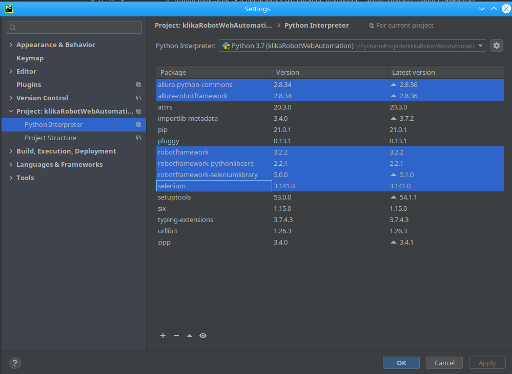
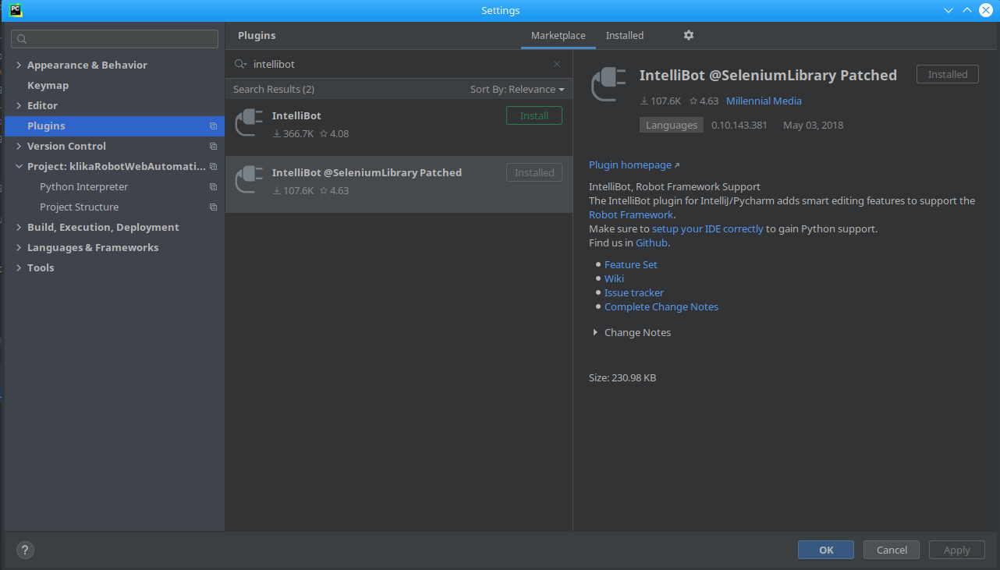

# UIWebAutomation_RobotFramework_SeleniumLibrary

## Description

This is project containing automated tests for IT company website.
The project uses Robot framework and SeleniumLibrary for web UI automation.
Since Robot framework is convenient not only for UI testing, but also for API and E2E testing,
the project can be easily extended to cover API of the application.
In that way we can have test coverage for both UI and API in a single project.

Robot test files are descriptive and explain the behaviour under test in a clear manner understandable easy by a manual tester.

## Dependencies
The project was setup on Debian 10 machine, which comes with Python2 and Python3 pre-installed.
In case you are using an OS that doesn't come with Python3, it will be required for you too install it.

* **Python3** - has to be installed in order to install pip3
  * python3 installation verification: `python3 --version`
* **Java** - only required for opening Allure report, it's not needed for test execution
* **PyCharm IDE Community Edition**
* **Pip3**:
    * Pip3 installation command:
    `sudo apt get update && sudo apt-get install python3-pip`
    * Pip3 installation verification:
    `pip3 --version`
* **Selenium**
  * Selenium pip package installation:
    `pip3 install selenium`
* **RobotFramework**:
  * `pip3 install robotframework`
  * Add directory containing scripts `robot` and `rebot` to `PATH` env variable: 
    To do this add line `export PATH=$PATH:/home/user/.local/bin` at the bottom of .bashrc file (Only for Linux).
    In my case paths to chromedriver and geckodriver are at the same path where rebot and robot scripts are, 
    this means that these 2 browser drivers will also be added to the PATH variable.
  * RobotFramework SeleniumLibrary pip package installation:
    `pip3 install robotframework-seleniumlibrary`
* **WebdriverManager**
  * WebdriverManager pip package installation:
    `pip3 install webdrivermanager`
  * WebdriverManager path configuration (in this step browser drivers are set on the same path where robot/rebot scripts reside):
    `webdrivermanager firefox chrome --linkpath /home/user/.local/bin`
* **Google Chrome browser** - Install Google Chrome browser latest version for your OS
* **Allure Reporter**
  * Allure pip package installation:
    `pip3 install allure-robotframework`
## PyCharm Project configuration
* In PyCharm -> Settings -> Project -> Python Interpreter -> Install packages from the image below

To install a package click on a `+` button.
* In PyCharm -> Settings -> Plugins -> Install IntelliBot SeleniumLibrary Patched Plugin:

  
## Test execution
* To run a specific test use:
  `robot --listener allure_robotframework ./TestCases/HomePageTest.robot`
* To run all test from the TestCases folder use:
  `robot --listener allure_robotframework ./TestCases/`

## Report generation
* To run allure reporter locally:
  `allure serve ./output/allure/`
  
## Clean report folder
* To clean report folder content run:
  `rm -rf ./output/allure/*`
  
## Video recording of test execution
